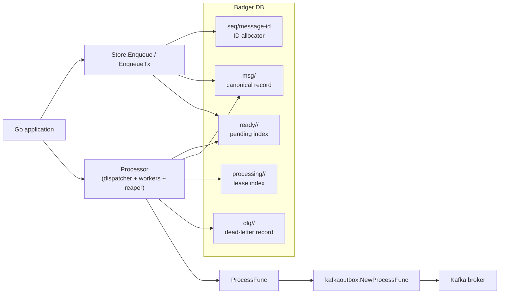
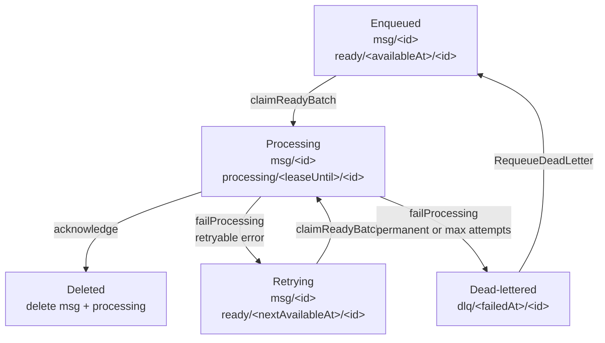

# Badger Box


`badgerbox` is an embedded, durable outbox library for Go applications. It uses [Badger](https://github.com/dgraph-io/badger) as a fast, embedded key/value store. It stores typed payloads and typed destinations, runs an embedded processor with a worker pool, and provides at-least-once delivery with retries, lease recovery, and a dead-letter queue.

The project also ships a Kafka-specific adapter in `./pkg/kafkaoutbox` built on [Franz-go](https://github.com/twmb/franz-go).

## Guarantees and constraints

- Delivery is at-least-once. Your `ProcessFunc` must be idempotent.
- The processor uses leases. If a worker dies or exceeds its lease, the message is requeued and may be delivered again.
- Badger allows only one live process to own a DB path. The example worker binary is for exclusive DB ownership only; it is not a multi-process shared-worker deployment model.
- Badger value log GC is still an operational responsibility of the embedding application.

## Architecture



## Outbox key flow

The store keeps one canonical message record plus time-ordered index keys that move as the message advances through the outbox lifecycle:



Prefix roles:

- `ob/<namespace>/msg/` stores the durable source-of-truth record.
- `ob/<namespace>/ready/` is the pending-work index scanned by the dispatcher in available-at order.
- `ob/<namespace>/processing/` is the in-flight lease index scanned by the reaper in lease-expiry order.
- `ob/<namespace>/dlq/` stores dead-letter records for failed messages.
- `ob/<namespace>/seq/message-id` is the Badger sequence key used to allocate message IDs.

## Roadmap
1. Add pluggable Metrics and Tracing providers and supply OTEL implementation.
2. Define/improve retry/DLQ re-enqueue documentation/examples.

## Install

```bash
go get github.com/shawnstephens/badgerbox
```

The demo lives in its own module under `cmd/badgerbox-demo`. Run it from that directory:

```bash
cd cmd/badgerbox-demo
go run . --help
```

If you want to run the demo from the repo root, create a local `go.work` file that includes both modules. `go.work` is gitignored in this repo, so this is a local convenience only:

```bash
go work init .
go work use ./cmd/badgerbox-demo
go run ./cmd/badgerbox-demo --help
```

## Demo binary

The demo binary runs three separate processes:

1. `kafka` starts a Kafka broker with Testcontainers and writes shared runtime state to `./.demo/badgerbox-demo/state.json`.
2. `producer` opens Badger, continuously enqueues messages into badgerbox, runs the badgerbox processor, and publishes to Kafka. It can start before Kafka is available and will keep retrying until the broker comes back.
3. `consumer` connects to the same Kafka broker and prints consumed messages.

Default workflow:

```bash
(cd cmd/badgerbox-demo && go run . kafka)
(cd cmd/badgerbox-demo && go run . producer)
(cd cmd/badgerbox-demo && go run . consumer)
```

With a local `go.work` file, the same flow can be run from the repo root:

```bash
go run ./cmd/badgerbox-demo kafka
go run ./cmd/badgerbox-demo producer
go run ./cmd/badgerbox-demo consumer
```

Defaults are chosen so you do not need to pass flags for the common case:

- shared state file: `./.demo/badgerbox-demo/state.json`
- Badger path: `./.demo/badgerbox-demo/badger`
- topic: `badgerbox-demo`
- topic partitions: `10`
- namespace: `demo`
- enqueue parallelism: `1`
- message interval: `500ms`
- processor concurrency: `4`
- retry base delay: `1s`
- retry max delay: `5s`
- poll interval: `250ms`
- lease duration: `30s`
- publish timeout: `2s`

Every flag also supports an environment variable with the `BADGERBOX_DEMO_` prefix. For example:

```bash
BADGERBOX_DEMO_ENQUEUE_PARALLELISM=4 \
BADGERBOX_DEMO_PROCESSOR_CONCURRENCY=8 \
(cd cmd/badgerbox-demo && go run . producer)
```

The `kafka` process owns the Testcontainers Kafka broker. Its state file is preserved on shutdown so the producer can start later, keep retrying against the stored broker metadata, and reconnect after Kafka restarts on a new mapped port. All demo output is printed to the console with colorized phase logs for startup, enqueue, processing, publish, consume, warnings, and shutdown.

Offline retry demo:

1. `badgerbox-demo kafka`
2. Stop it with `Ctrl+C`
3. `badgerbox-demo producer`
4. Watch repeated `phase=warning event=publish_failed` lines while messages continue to enqueue
5. `badgerbox-demo kafka`
6. `badgerbox-demo consumer`
7. Watch the producer log `phase=warning event=reload_state`, then `phase=ready event=reconnected`, and finally drain the backlog into Kafka for the consumer to print

Using repo-local commands, that flow is:

1. `(cd cmd/badgerbox-demo && go run . kafka)`
2. Stop it with `Ctrl+C`
3. `(cd cmd/badgerbox-demo && go run . producer)`
4. Watch repeated `phase=warning event=publish_failed` lines while messages continue to enqueue
5. `(cd cmd/badgerbox-demo && go run . kafka)`
6. `(cd cmd/badgerbox-demo && go run . consumer)`
7. Watch the producer reconnect and drain the backlog

The producer follows the preserved state file by default. If Kafka restarts with a new mapped port, the producer reloads the state file after a publish failure, rebuilds its Kafka client, and resumes publishing on the next retry. The producer still requires some broker source at startup, either from flags, environment variables, or the preserved state file.

## Generic producer example

```go
package main

import (
	"context"
	"log"

	"github.com/shawnstephens/badgerbox/pkg/badgerbox"
	"github.com/dgraph-io/badger/v4"
)

type OrderEvent struct {
	OrderID string `json:"order_id"`
	Status  string `json:"status"`
}

type HTTPDestination struct {
	URL    string `json:"url"`
	Method string `json:"method"`
}

func main() {
	db, err := badger.Open(badger.DefaultOptions("./data").WithLogger(nil))
	if err != nil {
		log.Fatal(err)
	}
	defer db.Close()

	store, err := badgerbox.New[OrderEvent, HTTPDestination](
		db,
		badgerbox.Serde[OrderEvent, HTTPDestination]{},
		badgerbox.Options{Namespace: "orders"},
	)
	if err != nil {
		log.Fatal(err)
	}
	defer store.Close()

	_, err = store.Enqueue(context.Background(), badgerbox.EnqueueRequest[OrderEvent, HTTPDestination]{
		Payload: OrderEvent{
			OrderID: "o-123",
			Status:  "created",
		},
		Destination: HTTPDestination{
			URL:    "https://example.internal/orders",
			Method: "POST",
		},
	})
	if err != nil {
		log.Fatal(err)
	}
}
```

## Enqueue within a caller-owned Badger transaction

```go
err := db.Update(func(txn *badger.Txn) error {
	if err := txn.Set([]byte("orders/o-123"), []byte("created")); err != nil {
		return err
	}

	_, err := store.EnqueueTx(context.Background(), txn, badgerbox.EnqueueRequest[OrderEvent, HTTPDestination]{
		Payload: OrderEvent{
			OrderID: "o-123",
			Status:  "created",
		},
		Destination: HTTPDestination{
			URL:    "https://example.internal/orders",
			Method: "POST",
		},
	})
	return err
})
```

## Generic embedded processor example

```go
processor, err := badgerbox.NewProcessor(
	store,
	func(ctx context.Context, msg badgerbox.Message[OrderEvent, HTTPDestination]) error {
		log.Printf("send %s to %s %s", msg.Payload.OrderID, msg.Destination.Method, msg.Destination.URL)
		return nil
	},
	badgerbox.ProcessorOptions{
		Concurrency: 4,
	},
)
if err != nil {
	log.Fatal(err)
}

if err := processor.Run(context.Background()); err != nil {
	log.Fatal(err)
}
```

## Kafka example

```go
package main

import (
	"context"
	"log"

	"github.com/shawnstephens/badgerbox/pkg/badgerbox"
	"github.com/shawnstephens/badgerbox/pkg/kafkaoutbox"
	"github.com/dgraph-io/badger/v4"
	"github.com/twmb/franz-go/pkg/kgo"
)

func main() {
	db, err := badger.Open(badger.DefaultOptions("./data").WithLogger(nil))
	if err != nil {
		log.Fatal(err)
	}
	defer db.Close()

	store, err := badgerbox.New[kafkaoutbox.KafkaMessage, kafkaoutbox.KafkaDestination](
		db,
		badgerbox.Serde[kafkaoutbox.KafkaMessage, kafkaoutbox.KafkaDestination]{},
		badgerbox.Options{Namespace: "kafka"},
	)
	if err != nil {
		log.Fatal(err)
	}
	defer store.Close()

	client, err := kgo.NewClient(kgo.SeedBrokers("localhost:9092"))
	if err != nil {
		log.Fatal(err)
	}
	defer client.Close()

	processFn := kafkaoutbox.NewProcessFunc(client, kafkaoutbox.Options{})
	processor, err := badgerbox.NewProcessor(store, processFn, badgerbox.ProcessorOptions{})
	if err != nil {
		log.Fatal(err)
	}

	_, err = store.Enqueue(context.Background(), badgerbox.EnqueueRequest[kafkaoutbox.KafkaMessage, kafkaoutbox.KafkaDestination]{
		Payload: kafkaoutbox.KafkaMessage{
			Key:   []byte("order-1"),
			Value: []byte(`{"status":"created"}`),
			Headers: map[string][]byte{
				"type": []byte("order.created"),
			},
		},
		Destination: kafkaoutbox.KafkaDestination{
			Topic: "orders.created",
		},
	})
	if err != nil {
		log.Fatal(err)
	}

	if err := processor.Run(context.Background()); err != nil {
		log.Fatal(err)
	}
}
```

## Testing

Run the unit suite:

```bash
go test ./...
```

Run the Kafka integration suite with Docker available:

```bash
go test -tags=integration ./...
```

Run the demo module tests separately:

```bash
(cd cmd/badgerbox-demo && go test ./...)
```
