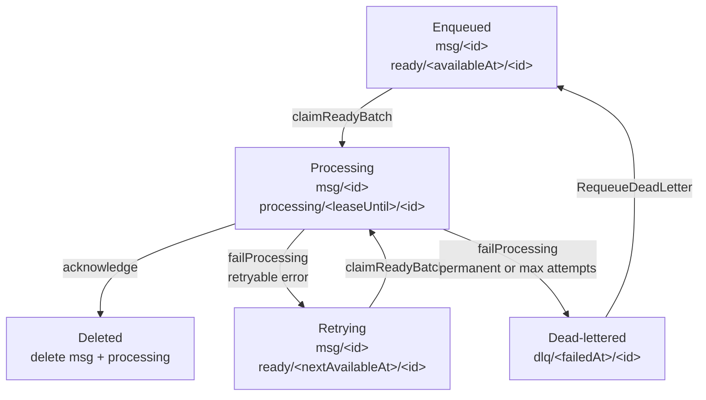

# badgerbox


`badgerbox` is a durable outbox library for Go applications that already use [Badger](https://github.com/dgraph-io/badger). It stores typed payloads and typed destinations under `./pkg/badgerbox`, runs an embedded processor with a worker pool, and provides at-least-once delivery with retries, lease recovery, and a dead-letter queue.

The project also ships a Kafka-specific adapter in `./pkg/kafkaoutbox` built on [Franz-go](https://github.com/twmb/franz-go).

## Guarantees and constraints

- Delivery is at-least-once. Your `ProcessFunc` must be idempotent.
- The processor uses leases. If a worker dies or exceeds its lease, the message is requeued and may be delivered again.
- Badger allows only one live process to own a DB path. The example worker binary is for exclusive DB ownership only; it is not a multi-process shared-worker deployment model.
- Badger value log GC is still an operational responsibility of the embedding application.

## Outbox key flow

The store keeps one canonical message record plus time-ordered index keys that move as the message advances through the outbox lifecycle:



Prefix roles:

- `ob/<namespace>/msg/` stores the durable source-of-truth record.
- `ob/<namespace>/ready/` is the pending-work index scanned by the dispatcher in available-at order.
- `ob/<namespace>/processing/` is the in-flight lease index scanned by the reaper in lease-expiry order.
- `ob/<namespace>/dlq/` stores dead-letter records for failed messages.
- `ob/<namespace>/seq/message-id` is the Badger sequence key used to allocate message IDs.

## Install

```bash
go get github.com/dgraph-io/badger/v4
go get github.com/twmb/franz-go/pkg/kgo
```

## Generic producer example

```go
package main

import (
	"context"
	"log"

	"badgerbox/pkg/badgerbox"
	"github.com/dgraph-io/badger/v4"
)

type OrderEvent struct {
	OrderID string `json:"order_id"`
	Status  string `json:"status"`
}

type HTTPDestination struct {
	URL    string `json:"url"`
	Method string `json:"method"`
}

func main() {
	db, err := badger.Open(badger.DefaultOptions("./data").WithLogger(nil))
	if err != nil {
		log.Fatal(err)
	}
	defer db.Close()

	store, err := badgerbox.New[OrderEvent, HTTPDestination](
		db,
		badgerbox.Serde[OrderEvent, HTTPDestination]{},
		badgerbox.Options{Namespace: "orders"},
	)
	if err != nil {
		log.Fatal(err)
	}
	defer store.Close()

	_, err = store.Enqueue(context.Background(), badgerbox.EnqueueRequest[OrderEvent, HTTPDestination]{
		Payload: OrderEvent{
			OrderID: "o-123",
			Status:  "created",
		},
		Destination: HTTPDestination{
			URL:    "https://example.internal/orders",
			Method: "POST",
		},
	})
	if err != nil {
		log.Fatal(err)
	}
}
```

## Enqueue within a caller-owned Badger transaction

```go
err := db.Update(func(txn *badger.Txn) error {
	if err := txn.Set([]byte("orders/o-123"), []byte("created")); err != nil {
		return err
	}

	_, err := store.EnqueueTx(context.Background(), txn, badgerbox.EnqueueRequest[OrderEvent, HTTPDestination]{
		Payload: OrderEvent{
			OrderID: "o-123",
			Status:  "created",
		},
		Destination: HTTPDestination{
			URL:    "https://example.internal/orders",
			Method: "POST",
		},
	})
	return err
})
```

## Generic embedded processor example

```go
processor, err := badgerbox.NewProcessor(
	store,
	func(ctx context.Context, msg badgerbox.Message[OrderEvent, HTTPDestination]) error {
		log.Printf("send %s to %s %s", msg.Payload.OrderID, msg.Destination.Method, msg.Destination.URL)
		return nil
	},
	badgerbox.ProcessorOptions{
		Concurrency: 4,
	},
)
if err != nil {
	log.Fatal(err)
}

if err := processor.Run(context.Background()); err != nil {
	log.Fatal(err)
}
```

## Kafka example

```go
package main

import (
	"context"
	"log"

	"badgerbox/pkg/badgerbox"
	"badgerbox/pkg/kafkaoutbox"
	"github.com/dgraph-io/badger/v4"
	"github.com/twmb/franz-go/pkg/kgo"
)

func main() {
	db, err := badger.Open(badger.DefaultOptions("./data").WithLogger(nil))
	if err != nil {
		log.Fatal(err)
	}
	defer db.Close()

	store, err := badgerbox.New[kafkaoutbox.KafkaMessage, kafkaoutbox.KafkaDestination](
		db,
		badgerbox.Serde[kafkaoutbox.KafkaMessage, kafkaoutbox.KafkaDestination]{},
		badgerbox.Options{Namespace: "kafka"},
	)
	if err != nil {
		log.Fatal(err)
	}
	defer store.Close()

	client, err := kgo.NewClient(kgo.SeedBrokers("localhost:9092"))
	if err != nil {
		log.Fatal(err)
	}
	defer client.Close()

	processFn := kafkaoutbox.NewProcessFunc(client, kafkaoutbox.Options{})
	processor, err := badgerbox.NewProcessor(store, processFn, badgerbox.ProcessorOptions{})
	if err != nil {
		log.Fatal(err)
	}

	_, err = store.Enqueue(context.Background(), badgerbox.EnqueueRequest[kafkaoutbox.KafkaMessage, kafkaoutbox.KafkaDestination]{
		Payload: kafkaoutbox.KafkaMessage{
			Key:   []byte("order-1"),
			Value: []byte(`{"status":"created"}`),
			Headers: map[string][]byte{
				"type": []byte("order.created"),
			},
		},
		Destination: kafkaoutbox.KafkaDestination{
			Topic: "orders.created",
		},
	})
	if err != nil {
		log.Fatal(err)
	}

	if err := processor.Run(context.Background()); err != nil {
		log.Fatal(err)
	}
}
```

## Testing

Run the unit suite:

```bash
go test ./...
```

Run the Kafka integration suite with Docker available:

```bash
go test -tags=integration ./...
```
