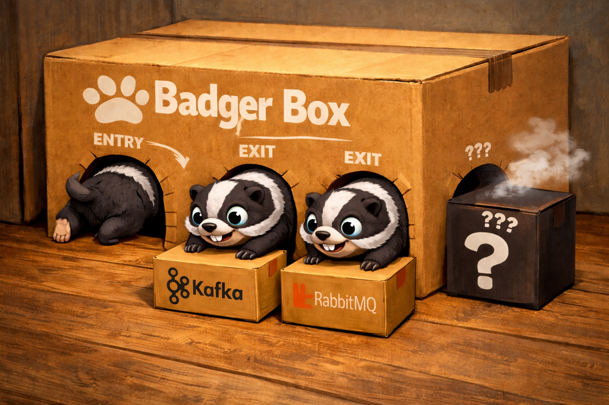
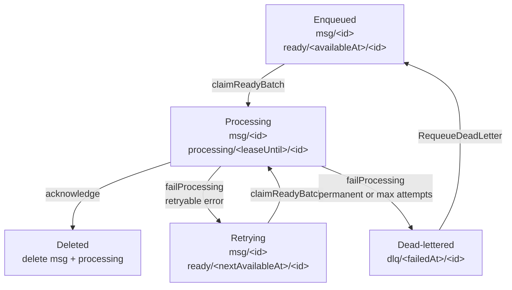

# Badger Box

[](https://github.com/shawnstephens/badgerbox/actions/workflows/ci.yml)



`badgerbox` is an embedded, durable outbox library for Go applications. It uses [Badger](https://github.com/dgraph-io/badger) as a fast, embedded key/value store. It stores typed payloads and typed destinations, runs an embedded processor with a worker pool, and provides at-least-once delivery with retries, lease recovery, and a dead-letter queue.

The project also ships a Kafka-specific adapter in `./pkg/kafkaoutbox` built on [Franz-go](https://github.com/twmb/franz-go).

> [!WARNING]
> Badger Box is under active development. There is no release yet, and breaking changes are likely until the project reaches an initial stable release.

## Observability

`badgerbox` supports optional OpenTelemetry metrics and tracing directly in core.

- Observability is opt-in.
- `badgerbox.New(...)` is a pure constructor. It does not start background polling or record an initial snapshot.
- `Processor.Run(ctx)` records one initial snapshot and starts observability polling automatically. If you are not running a processor, call `store.RecordObservabilitySnapshot(ctx)` and `store.StartObservability(ctx)` yourself.
- Enqueue and processing traces can be linked across the durable queue boundary.
- Queue depth, processing, retry, dead-letter, and tracing metrics are supported in core.
- Inject `badgerbox.Options.Runtime` in tests when you need deterministic time, retry, ticker, or lease-token behavior.
- The demo producer also republishes selected Badger `expvar` metrics on `/metrics` with Prometheus's expvar collector for Badger-specific storage metrics.

See [OBSERVABILITY.md](/Users/shawn/Development/go/badgerbox/OBSERVABILITY.md) for setup, metric and trace details, and the local OTEL Collector + Grafana + Tempo demo stack.

## Guarantees and constraints

- Delivery is at-least-once. Your `ProcessFunc` must be idempotent.
- The processor uses leases. If a worker dies or exceeds its lease, the message is requeued and may be delivered again.
- Badger allows only one live process to own a DB path. The example worker binary is for exclusive DB ownership only; it is not a multi-process shared-worker deployment model.
- Badger value log GC is still an operational responsibility of the embedding application.

If you keep a long-lived Badger DB, run value-log GC periodically from your application. `badgerbox` removes processed messages logically, but Badger only reclaims old value-log space when you call `RunValueLogGC` yourself. A simple maintenance loop looks like this:

```go
go func() {
	ticker := time.NewTicker(10 * time.Minute)
	defer ticker.Stop()

	for range ticker.C {
		for {
			if err := db.RunValueLogGC(0.5); err != nil {
				break
			}
		}
	}
}()
```

If you never run value-log GC, disk usage can keep growing even though outbox messages are being acknowledged and deleted.

## Architecture

```mermaid
flowchart LR
    app["Go application"]
    producer["Store.Enqueue / EnqueueTx"]
    processor["Processor<br/>(dispatcher + workers + reaper)"]
    handler["ProcessFunc"]
    kafka["kafkaoutbox.NewProcessFunc"]

    subgraph badger["Badger DB"]
        msg["msg/<id><br/>canonical record"]
        ready["ready/<availableAt>/<id><br/>pending index"]
        processing["processing/<leaseUntil>/<id><br/>lease index"]
        dlq["dlq/<failedAt>/<id><br/>dead-letter record"]
        seq["seq/message-id<br/>ID allocator"]
    end

    app --> producer
    app --> processor
    producer --> seq
    producer --> msg
    producer --> ready

    processor --> ready
    processor --> msg
    processor --> processing
    processor --> dlq

    processor --> handler
    handler --> kafka
    kafka --> broker["Kafka broker"]
```



## Outbox key flow

The store keeps one canonical message record plus time-ordered index keys that move as the message advances through the outbox lifecycle:



Prefix roles:

- `ob/<namespace>/msg/` stores the durable source-of-truth record.
- `ob/<namespace>/ready/` is the pending-work index scanned by the dispatcher in available-at order.
- `ob/<namespace>/processing/` is the in-flight lease index scanned by the reaper in lease-expiry order.
- `ob/<namespace>/dlq/` stores dead-letter records for failed messages.
- `ob/<namespace>/seq/message-id` is the Badger sequence key used to allocate message IDs.

## Install

```bash
go get github.com/shawnstephens/badgerbox
```

The demo lives in its own module under `demo`. Run it from that directory:

```bash
cd demo
go run . --help
```

The repo includes a checked-in `go.work` file for local development, so you can also run the demo from the repo root:

```bash
go run ./demo --help
```

## Demo binary

The demo binary runs three separate processes:

1. `kafka` starts a Kafka broker with Testcontainers and writes shared runtime state to `./.demo/badgerbox-demo/state.json`.
2. `producer` opens Badger, continuously enqueues messages into badgerbox, runs the badgerbox processor, and publishes to Kafka. It can start before Kafka is available and will keep retrying until the broker comes back.
3. `consumer` connects to the same Kafka broker and prints consumed messages.

Default workflow:

```bash
(cd demo && go run . kafka)
(cd demo && go run . producer)
(cd demo && go run . consumer)
```

From the repo root, the same flow can be run as:

```bash
go run ./demo kafka
go run ./demo producer
go run ./demo consumer
```

Defaults are chosen so you do not need to pass flags for the common case:

- shared state file: `./.demo/badgerbox-demo/state.json`
- Badger path: `./.demo/badgerbox-demo/badger`
- topic: `badgerbox-demo`
- topic partitions: `10`
- namespace: `demo`
- enqueue parallelism: `1`
- message interval: `500ms`
- processor concurrency: `4`
- retry base delay: `1s`
- retry max delay: `5s`
- poll interval: `250ms`
- lease duration: `30s`
- publish timeout: `2s`
- Badger value-log GC interval: `1m`
- Badger value-log GC discard ratio: `0.5`

Every flag also supports an environment variable with the `BADGERBOX_DEMO_` prefix. For example:

```bash
BADGERBOX_DEMO_ENQUEUE_PARALLELISM=4 \
BADGERBOX_DEMO_PROCESSOR_CONCURRENCY=8 \
(cd demo && go run . producer)
```

The `kafka` process owns the Testcontainers Kafka broker. Its state file is preserved on shutdown so the producer can start later, keep retrying against the stored broker metadata, and reconnect after Kafka restarts on a new mapped port. All demo output is printed to the console with colorized phase logs for startup, enqueue, processing, publish, consume, warnings, and shutdown.

The producer also runs Badger value-log GC periodically with a discard ratio of `0.5`. Adjust the interval with `--badger-gc-interval` or `BADGERBOX_DEMO_BADGER_GC_INTERVAL`.

Offline retry demo:

1. `badgerbox-demo kafka`
2. Stop it with `Ctrl+C`
3. `badgerbox-demo producer`
4. Watch repeated `phase=warning event=publish_failed` lines while messages continue to enqueue
5. `badgerbox-demo kafka`
6. `badgerbox-demo consumer`
7. Watch the producer log `phase=warning event=reload_state`, then `phase=ready event=reconnected`, and finally drain the backlog into Kafka for the consumer to print

Using repo-local commands, that flow is:

1. `(cd demo && go run . kafka)`
2. Stop it with `Ctrl+C`
3. `(cd demo && go run . producer)`
4. Watch repeated `phase=warning event=publish_failed` lines while messages continue to enqueue
5. `(cd demo && go run . kafka)`
6. `(cd demo && go run . consumer)`
7. Watch the producer reconnect and drain the backlog

The producer follows the preserved state file by default. If Kafka restarts with a new mapped port, the producer reloads the state file after a publish failure, rebuilds its Kafka client, and resumes publishing on the next retry. The producer still requires some broker source at startup, either from flags, environment variables, or the preserved state file.

## Generic producer example

```go
package main

import (
	"context"
	"log"

	"github.com/shawnstephens/badgerbox/pkg/badgerbox"
	"github.com/dgraph-io/badger/v4"
)

type OrderEvent struct {
	OrderID string `json:"order_id"`
	Status  string `json:"status"`
}

type HTTPDestination struct {
	URL    string `json:"url"`
	Method string `json:"method"`
}

func main() {
	db, err := badger.Open(badger.DefaultOptions("./data").WithLogger(nil))
	if err != nil {
		log.Fatal(err)
	}
	defer db.Close()

	store, err := badgerbox.New[OrderEvent, HTTPDestination](
		db,
		badgerbox.Serde[OrderEvent, HTTPDestination]{},
		badgerbox.Options{Namespace: "orders"},
	)
	if err != nil {
		log.Fatal(err)
	}
	defer store.Close()

	_, err = store.Enqueue(context.Background(), badgerbox.EnqueueRequest[OrderEvent, HTTPDestination]{
		Payload: OrderEvent{
			OrderID: "o-123",
			Status:  "created",
		},
		Destination: HTTPDestination{
			URL:    "https://example.internal/orders",
			Method: "POST",
		},
	})
	if err != nil {
		log.Fatal(err)
	}
}
```

## Enqueue within a caller-owned Badger transaction

```go
err := db.Update(func(txn *badger.Txn) error {
	if err := txn.Set([]byte("orders/o-123"), []byte("created")); err != nil {
		return err
	}

	_, err := store.EnqueueTx(context.Background(), txn, badgerbox.EnqueueRequest[OrderEvent, HTTPDestination]{
		Payload: OrderEvent{
			OrderID: "o-123",
			Status:  "created",
		},
		Destination: HTTPDestination{
			URL:    "https://example.internal/orders",
			Method: "POST",
		},
	})
	return err
})
```

## Generic embedded processor example

```go
processor, err := badgerbox.NewProcessor(
	store,
	func(ctx context.Context, msg badgerbox.Message[OrderEvent, HTTPDestination]) error {
		log.Printf("send %s to %s %s", msg.Payload.OrderID, msg.Destination.Method, msg.Destination.URL)
		return nil
	},
	badgerbox.ProcessorOptions{
		Concurrency: 4,
	},
)
if err != nil {
	log.Fatal(err)
}

if err := processor.Run(context.Background()); err != nil {
	log.Fatal(err)
}
```

## Kafka example

```go
package main

import (
	"context"
	"log"

	"github.com/shawnstephens/badgerbox/pkg/badgerbox"
	"github.com/shawnstephens/badgerbox/pkg/kafkaoutbox"
	"github.com/dgraph-io/badger/v4"
	"github.com/twmb/franz-go/pkg/kgo"
)

func main() {
	db, err := badger.Open(badger.DefaultOptions("./data").WithLogger(nil))
	if err != nil {
		log.Fatal(err)
	}
	defer db.Close()

	store, err := badgerbox.New[kafkaoutbox.KafkaMessage, kafkaoutbox.KafkaDestination](
		db,
		badgerbox.Serde[kafkaoutbox.KafkaMessage, kafkaoutbox.KafkaDestination]{},
		badgerbox.Options{Namespace: "kafka"},
	)
	if err != nil {
		log.Fatal(err)
	}
	defer store.Close()

	client, err := kgo.NewClient(kgo.SeedBrokers("localhost:9092"))
	if err != nil {
		log.Fatal(err)
	}
	defer client.Close()

	processFn := kafkaoutbox.NewProcessFunc(client, kafkaoutbox.Options{})
	processor, err := badgerbox.NewProcessor(store, processFn, badgerbox.ProcessorOptions{})
	if err != nil {
		log.Fatal(err)
	}

	_, err = store.Enqueue(context.Background(), badgerbox.EnqueueRequest[kafkaoutbox.KafkaMessage, kafkaoutbox.KafkaDestination]{
		Payload: kafkaoutbox.KafkaMessage{
			Key:   []byte("order-1"),
			Value: []byte(`{"status":"created"}`),
			Headers: map[string][]byte{
				"type": []byte("order.created"),
			},
		},
		Destination: kafkaoutbox.KafkaDestination{
			Topic: "orders.created",
		},
	})
	if err != nil {
		log.Fatal(err)
	}

	if err := processor.Run(context.Background()); err != nil {
		log.Fatal(err)
	}
}
```

## Testing

Run the unit suite:

```bash
go test ./...
```

Run the Kafka integration suite with Docker available:

```bash
go test -tags=integration ./...
```

Run the demo module tests separately:

```bash
(cd demo && go test ./...)
```
