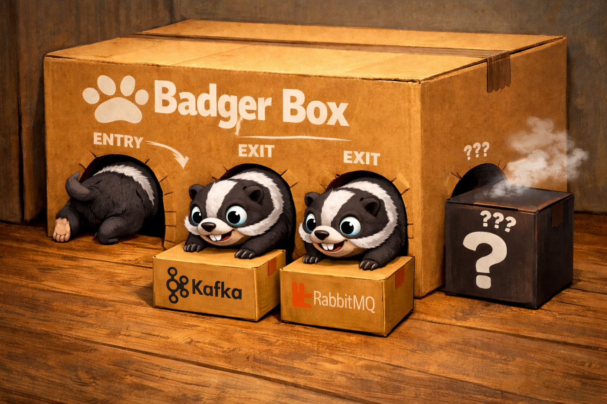

# Badger Box

[](https://github.com/shawnstephens/badgerbox/actions/workflows/ci.yml)



Badger Box is an embedded, durable message queue for Go. It stores typed payloads and destinations through injected codecs, delivers batches, and provides retries, lease recovery, consistency audits, and dead-letter administration. Delivery is **at least once** within the configured durability boundary: consumers must tolerate duplicates. See the write-durability requirements below.

This is a prerelease API and storage-format break. Existing unversioned or incompatible queue directories are rejected before sequence allocation. Use a fresh directory; see [storage compatibility](docs/STORAGE.md).

Start with the [tuning and capacity guide](docs/TUNING.md) for memory, disk, CPU, payload size, outage budgets, and reproducible demo benchmarks.

Use an [enqueue admission guard](docs/ADMISSION.md) to reject intake under disk pressure while allowing existing messages to settle.
Set [claim byte budgets](docs/QUARANTINE.md) to limit source reads and recover oversized or undecodable messages through quarantine.

## Packages

The layout follows the relevant library, executable, and deployment conventions in [project-layout](https://github.com/golang-standards/project-layout).

| Path | Responsibility |
| --- | --- |
| `pkg/badgerbox` | Typed stores, codecs, processing, retries, snapshots, audits, dead letters |
| `pkg/kafka` | Optional franz-go delivery adapter and partitioner |
| `pkg/adminhttp` | Metadata-only, bounded HTTP administration routes |
| `pkg/maintenance` | Database-wide startup flattening and periodic value-log GC |
| `pkg/telemetry` | OpenTelemetry configuration, database metrics, maintenance and delivery observers |
| `pkg/runner` | Shared database ownership, typed queue registration, ordered shutdown |
| `internal/instrumentation` | Queue instrumentation and internal delivery context plumbing |
| `cmd/badgerbox-demo` | Separate Go module containing the runnable demo |
| `deployments/observability` | Local collector, dashboards, and backend configuration |
| `tests/integration` | Process-level recovery validation |

## Codecs and storage

`Codec[T]` defines `Marshal(T) ([]byte, error)` and `Unmarshal([]byte) (T, error)`. Supply message and destination codecs independently through `Serde[M,D]`. Each missing codec defaults to `JSONCodec[T]`; JSON is optional. Codec output remains opaque bytes throughout persistence, retry, and dead-letter requeue. Codecs must be safe for concurrent use.

```go
store, err := badgerbox.New[Payload, Destination](db,
    badgerbox.Serde[Payload, Destination]{
        Message: payloadCodec,
        Destination: destinationCodec,
    },
    badgerbox.Options{Namespace: "events"},
)
```

See the executable [binary codec example](pkg/badgerbox/example_test.go). Snapshots, audits, and HTTP dead-letter listings never invoke application codecs. HTTP responses contain storage metadata only; payloads and destinations are omitted, and application JSON marshalers are never called.

`Enqueue` commits a record and its indexes atomically. `EnqueueTx` prepares the same changes inside a caller-owned Badger transaction; the caller must commit it. All public operations require a non-nil context. One live process owns each database directory.

Transaction atomicity covers application state in the same Badger transaction. A write to another database followed by a Badger enqueue is not an atomic outbox. Messages can be reordered by concurrent delivery and retries; use stable application event IDs for downstream deduplication.

Badger defaults `SyncWrites` to `false`: writes use memory mapping and can survive a process crash, but a successful enqueue or acknowledgement does not establish hard-reboot or power-loss durability. For that boundary, open the database with `badger.DefaultOptions(path).WithSyncWrites(true)` so writes are synchronized to storage; this still depends on the filesystem and device honoring synchronization. `runner.Open` preserves caller-selected Badger options and does not enable this setting implicitly. An `EnqueueTx` success only prepares changes; the caller must successfully commit the transaction before treating the enqueue as committed.

The recovery tests enable `SyncWrites(true)` and kill an isolated process with SIGKILL. They verify process-crash recovery, including committed acknowledgements staying deleted; they do not simulate host failure or power loss.

Enqueue and requeue reject records with `ErrMessageTooLarge` if later lifecycle transitions cannot fit Badger's storage limits. Admission reserves 32 KiB of lifecycle headroom. Keep those limits when reopening populated databases; reducing them requires migration. Stored failure text is capped at 4 KiB with a truncation marker, and custom runtimes must return unique nonempty UTF-8 lease tokens of at most 256 bytes. Admission normalizes mutable availability and attempt-limit metadata so unchanged payloads retain their storage budget across requeues.

## Processing

`NewBatchProcessor` accepts a `BatchProcessFunc[M,D]`. The function sends exactly one `BatchProcessResult` per message and leaves the result channel open. Each result is settled independently. A nil error acknowledges the record; a retryable error schedules it again; `Permanent(err)` sends that message to the dead-letter queue. Function-level errors, panics, missing results, and cancellation retry unresolved messages.

`NewProcessor` accepts a single-message `ProcessFunc` and `ProcessorOptions`. Every available worker reserves exactly one message. `NewBatchProcessor` accepts `BatchProcessorOptions`, which embeds the shared `ProcessorOptions` and adds `ClaimBatchSize`. Runner queue registration uses these batch options.

Each processing span starts before its callback and ends with settlement. Single-message callbacks receive the message trace and persisted baggage directly. Batch callbacks call `badgerbox.ContextForMessage(ctx, message.ID)` for per-message work; this preserves callback-added deadlines and cancellation. `ProcessorOptions.SettlementTimeout` bounds detached settlement.

Zero processor settings select defaults. Negative settings are rejected; an
explicit retry maximum must be at least the effective retry base (1 second when
the base is omitted).

Workers reserve capacity before claiming. Large claim transactions reduce the effective batch size on Badger's transaction-size limit. Expired leases are recovered in bounded pages. Undispatched claims are released without consuming an attempt.

| Core default | Value |
| --- | --- |
| Workers / maximum batch claim | 4 / 32 (single-message workers always claim 1) |
| Poll interval / lease | 250ms / 30s |
| Retry base / maximum delay | 1s / 1h |
| Maximum attempts | 36 |
| Expired-lease recovery page | 64 |
| Detached settlement budget | 10s |

Callbacks must return when their context is canceled. `Run` joins callback invocations before returning. Caller-owned asynchronous delivery clients must then be flushed and closed to join their remaining callbacks. A broker acceptance followed by a process crash before durable acknowledgement can produce duplicates.

Workers retain their concurrency slots until synchronous callbacks return, including cleanup after cancellation or lease expiry. Downstream clients must separately bound any asynchronous work that outlives those callbacks.

## Owning the lifecycle

For several queues in one database, use `runner.Open`, generic `runner.Register`, optional `RegisterDelivery`, and `Start`. Registration requires unique nonempty namespaces. Each registered queue retains its own typed payload, destination, codecs, and processor settings.

`runner.Options.QueueFailurePolicy` defaults to `runner.IsolateQueue`: a worker failure stops that namespace while healthy queues and maintenance continue. `runner.FailFast` cancels all workers and maintenance. Failed queues are not automatically restarted. `Errors()` emits `*runner.QueueError` values carrying the namespace and original cause (`errors.Is`/`errors.As` work). Notifications are nonblocking and may be dropped if their buffer is full; `Stop` and `Shutdown` return the aggregate of all worker failures. Applications using isolation should handle a notification without assuming that all processing has stopped.

Stop intake first, then call `Shutdown` with a deadline. The runner joins workers and maintenance, flushes and closes named delivery clients, closes store instrumentation, unregisters database metrics, and closes Badger. A worker-join timeout leaves dependencies open so shutdown can be retried. Badger maintenance and close calls cannot be forcibly canceled; after joining succeeds, an ongoing closer may finish after the caller's deadline.

The lower-level `badgerbox.New` constructor accepts a caller-owned database. Its `Close` closes only that store's resources. For direct use, join processors and stop maintenance before closing stores and Badger.

## Kafka delivery

Create clients with `kafka.NewClient(opts...)`; it installs the required partitioner after caller options. Both `kafka.NewBatchProducerFunc(client)` and `kafka.NewProcessFunc(client, options)` return a function and an error. They reject nil clients or clients without `KafkaPartitioner` before any delivery. Explicit configuration with `kgo.RecordPartitioner(kafka.KafkaPartitioner())` is also supported. A nil destination partition selects automatic partitioning. A nonnegative explicit partition selects that partition; negative explicit values are permanent validation errors. Records clone payload bytes, keys, and sorted headers before asynchronous production.

The client and adapter constructors also require `kgo.AllISRAcks()` and reject `TransactionalID` and `DefaultProduceTopicAlways`. A produce callback must confirm broker acceptance at the requested topic before the outbox acknowledges it; it cannot stand in for Kafka transaction commit. Configure broker replication and `min.insync.replicas` to meet your durability requirements.

## Snapshots and administration

`QueueSnapshot` scans lifecycle and creation index keys; it does not read payload records or maintain sharded counters. A nonempty state with no creation index returns `ErrInconsistentIndex`. `Audit` reconciles all live rows, lifecycle/creation indexes, and dead letters without mutations. Reports contain bounded content-free anomaly samples. `AuditOptions.MaxScannedKeys` defaults to 100,000 and `MaxScannedBytes` to 64 MiB; zero selects defaults and negative values are invalid. One budget covers all rows and indexes, including dead-letter history. Limits are checked before copying values or retaining identifiers. Memory scales with these budgets, which are not an exact heap-size guarantee. Exhaustion returns `ErrAuditLimitExceeded` and a partial report with `Complete=false`, `ScannedKeys`, and `ScannedBytes`. Missing-index conclusions require the relevant scan to finish.

Full-data dead-letter lists retain count and encoded-byte limits. `ListDeadLetterMetadata` provides a codec-free alternative, returning at most 1,000 summaries and defaulting to a 2 MiB stored-value budget. Oversized records return key-derived identity, failure time, stored size, an oversized marker, and a continuation cursor without loading their values. Ordinary entries include metadata with failure text capped at 1 KiB and explicit truncation. Each entry has a cursor for resuming after it; the final page cursor is nil.

Requeue requires the exact message ID and failure timestamp and refuses to overwrite a live message. `RequeueDeadLetterWithOptions` checks `MaxBytes` before loading the record; zero disables this limit for trusted callers. It preserves opaque payload bytes without application decoding.

`adminhttp.New(store, options)` exposes:

- `GET /audit?sample_limit=20`
- `GET /dead-letters?page_size=100&cursor=...`
- `POST /dead-letters/{message_id}/requeue` with `failed_at` and optional `available_at` RFC3339 timestamps

Handlers default to one 30s deadline covering body reading, storage, encoding, and flushing; an 8 MiB encoded response limit; four concurrent lists; one audit; one concurrent requeue; a 2 MiB requeue stored-value limit; and 16 KiB request bodies. `MaxConcurrentRequeues` and `MaxRequeueBytes` configure mutation limits. Namespace names are limited to 256 bytes. Admission includes flushing and returns 429 immediately when full. Hosting middleware must preserve response-controller read/write deadlines and flush support.

Dead-letter responses contain `message_id`, `failed_at`, `stored_bytes`, `oversized`, and optional `metadata`; oversized entries omit metadata but remain navigable. Encoded pages stop before exceeding the response budget and resume after the last returned row. If necessary, the first row omits its failure text with `failure_text_truncated=true`. Audit budget exhaustion returns 413 with `code: "audit_incomplete"` and progress; oversized requeues return 413 with `code: "dead_letter_too_large"`. Audit responses mark omitted anomaly samples with `samples_truncated=true`. Authentication and network exposure are application responsibilities; the demo listens on loopback by default.

## Telemetry and maintenance

Inject OpenTelemetry meter/tracer providers and a propagator through `telemetry.Options`. The library chooses no exporter and does not replace global providers. Queue metrics use fixed names with namespace attributes. One process-wide database collector reports disk capacity, Badger sizes and compaction, and reset-safe compaction counters. Maintenance and shared-client flush observers report outcomes separately.

The runner owns optional startup flattening and periodic value-log GC. Each GC tick continues after successful rewrites until no rewrite is available, another error occurs, cancellation is requested, or a budget is exhausted. `ValueLogGCMaxRuns` and `ValueLogGCMaxDuration` default to eight calls and one second; negative values are invalid. The time budget limits starting another call, and shutdown still waits for an in-flight Badger call to finish. Direct users can compose `maintenance.Service` with their own database lifecycle. See [observability](docs/OBSERVABILITY.md) and [memory tuning](docs/MEMORY.md).

## Demo

Use Go 1.26 or newer. Run from the demo module, independently of a local `go.work`:

```sh
cd cmd/badgerbox-demo
GOWORK=off go run . kafka
# Separate terminals, same directory:
GOWORK=off go run . producer
GOWORK=off go run . consumer
```

A Docker-compatible container runtime is required for Kafka. The producer can also run with `--logging-producer`. The default admin listener is `127.0.0.1:3031`; `--admin-listen-addr ''` disables it.

The demo supports OTLP HTTP/protobuf by default and optional gRPC:

```sh
GOWORK=off go run . producer --logging-producer \
  --otel-endpoint localhost:34318 --otel-insecure
GOWORK=off go run . producer --logging-producer \
  --otel-protocol grpc --otel-endpoint localhost:34317 --otel-insecure
```

TLS is the exporter default. Plaintext is explicit for local collectors. `--help` lists Badger memory, batching, retry, and listener settings. Demo retry timing is intentionally faster than the core defaults.

Run a finite disk-backed benchmark with delivery verification and a JSON report:

```sh
GOWORK=off go run . benchmark --messages 10000 --payload-bytes 1024 \
  --badger-sync-writes --output /tmp/badgerbox-benchmark.json
```

It verifies accepted messages, payloads, the empty queue, and a final audit; reports include latency, throughput, sampled RSS/heap/disk, CPU, and OpenTelemetry totals. Add `--brokers localhost:9092` for independent Kafka consumer verification. See [tuning](docs/TUNING.md) for comparison profiles and measurement limits.

The [benchmark guide](cmd/badgerbox-demo/BENCHMARK.md) documents fault injection,
the repeatable matrix runner, and what each reported measurement includes.

## Validation

From the repository root:

```sh
just check
just test-integration
just benchmark
```

Both modules are checked with `GOWORK=off`. Integration tests exercise a real Kafka broker plus SIGTERM/SIGKILL recovery in separate processes, including a mixed acknowledged, delivered-but-unacknowledged, and ready-message checkpoint. Benchmarks cover queue workloads and compare index snapshots with full record scans. See [the implementation stack](plan.md) for review order and validation scope.

The [production-readiness verification](docs/READINESS.md) records resource-control,
quarantine, full-filesystem, Kafka, and crash-recovery evidence, including a
container benchmark with explicit CPU and memory limits. Use its stated scope
when sizing a deployment and choosing a failure budget.
