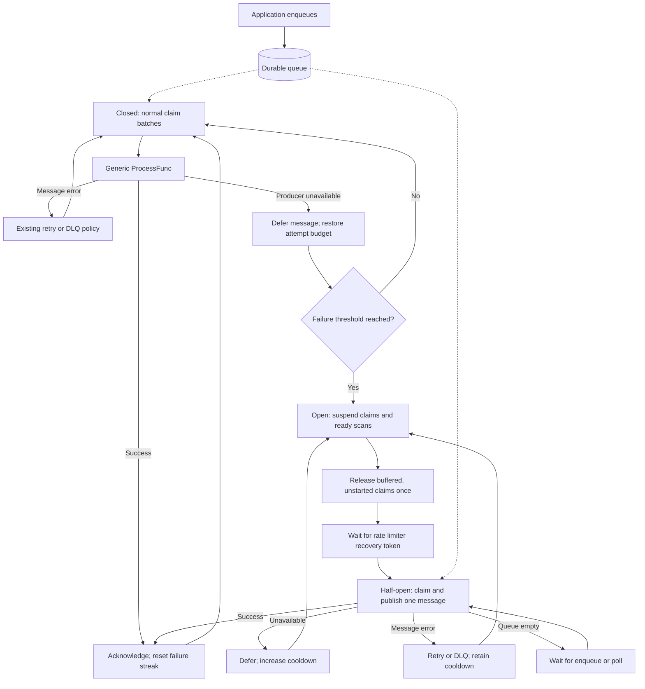

# Producer circuit breaker

BadgerBox can suspend claims when a downstream producer is unavailable. The circuit breaker lives in the generic processor, before the ready-queue scan and claim transaction. It uses [`golang.org/x/time/rate`](https://pkg.go.dev/golang.org/x/time/rate) for admission and recovery pacing, and works with Kafka or any other `ProcessFunc`.

Enqueue operations continue while delivery is paused. Pending messages remain durable without repeated claim, lease, and retry writes.

## Delivery flow



**Closed:** normal claim batches run without throttling (`rate.Inf`). Successful deliveries reset the availability-failure streak. Message-specific failures are neutral observations and retain the normal retry or DLQ policy.

**Open:** the dispatcher stops ready scans and new claim admissions. Polls and enqueue notifications cannot bypass the gate. The rate limiter has burst size one; its initial token is consumed before reserving a recovery token so opening always waits a full cooldown.

**Half-open:** one real queued message tests recovery through the normal producer path. A separate in-flight flag prevents overlapping trials even if publishing is slow. Success closes the circuit and resumes dispatch immediately. An unavailable result doubles the cooldown up to the maximum. A message error applies the retry/DLQ policy and reopens for the same cooldown. If nothing is ready, the processor retains recovery permission and waits for an enqueue or poll.

The dispatcher uses `ReserveN`, `DelayFrom`, and the injected runtime's cancellable sleep. No health-check API is required. Reservations are replaced on each reopening and canceled on shutdown; obsolete results cannot change a newer circuit generation.

## Configuration

The library is opt-in: `ProcessorOptions.CircuitBreaker == nil` preserves existing processing and retry behavior. Pass a non-nil options pointer to enable it.

| Option | Default | Meaning |
| --- | --- | --- |
| `FailureThreshold` | `3` | Unavailable observations before opening; successes reset the streak |
| `InitialCooldown` | `5s` | Initial recovery delay and unavailable-message deferral delay |
| `MaxCooldown` | `1m` | Maximum delay after repeated failed recovery trials |
| `IsUnavailable` | `badgerbox.IsUnavailable` | Concurrency-safe downstream-outage classifier |
| `OnStateChange` | `nil` | Optional nonblocking, concurrency-safe notification receiving `from, to string` |

Zero numeric fields select defaults. Negative values or a maximum below the normalized initial cooldown are rejected by `NewProcessor`. State notifications use `closed`, `open`, and `half_open`; they run outside the breaker lock and concurrent notifications may arrive out of order. Options are copied at construction. Mutable state belongs to each `Run` and starts closed on restart.

### Generic producer

Keep your existing payload and destination types and `ProcessFunc` signature. Mark only downstream outages:

```go
processFn := func(ctx context.Context, msg badgerbox.Message[OrderEvent, HTTPDestination]) error {
    publishCtx, cancel := context.WithTimeout(ctx, 2*time.Second)
    defer cancel()

    err := publishOrder(publishCtx, msg)
    if isDeliveryServiceUnavailable(err) {
        return badgerbox.Unavailable(err)
    }
    return err
}

processor, err := badgerbox.NewProcessor(store, processFn, badgerbox.ProcessorOptions{
    CircuitBreaker: &badgerbox.CircuitBreakerOptions{},
})
if err != nil {
    return err
}
return processor.Run(ctx)
```

Here `publishOrder` and `isDeliveryServiceUnavailable` are application functions. `Unavailable(nil)` returns nil; wrapping preserves `errors.Is` and `errors.As`. Alternatively, set `CircuitBreakerOptions.IsUnavailable` to classify your existing producer errors. That function must be safe for concurrent calls.

Permanent errors take precedence over unavailable classification. Processor shutdown does not count as an outage or recovery. Ordinary errors and recovered producer panics use normal retries. Batch-level unavailable errors defer unresolved records while preserving any reported per-message results; duplicate or unknown results never update the breaker. During shutdown, known results are still settled using the existing bounded settlement context, without changing breaker state; Badger errors stop the processor and do not trip the circuit.

### Kafka

The Kafka adapter marks connection errors, exhausted record-delivery deadlines, and Kafka request-timeout, network-exception, and broker-unavailable errors. It preserves original errors. Missing topics, topic-specific authorization, message-size errors, local configuration errors, and client closure are not automatically treated as outages. Not every retryable Kafka error indicates a shared outage.

```go
processFn, err := kafka.NewProcessFunc(client, kafka.Options{})
if err != nil {
    return err
}
processor, err := badgerbox.NewProcessor(store,
    func(ctx context.Context, msg badgerbox.Message[kafka.KafkaMessage, kafka.KafkaDestination]) error {
        publishCtx, cancel := context.WithTimeout(ctx, 2*time.Second)
        defer cancel()
        return processFn(publishCtx, msg)
    },
    badgerbox.ProcessorOptions{
        LeaseDuration: 30 * time.Second,
        CircuitBreaker: &badgerbox.CircuitBreakerOptions{
            FailureThreshold: 3,
            InitialCooldown:  5 * time.Second,
            MaxCooldown:      time.Minute,
        },
    },
)
if err != nil {
    return err
}
return processor.Run(ctx)
```

Custom Kafka publishers can call `kafka.ClassifyProducerError(err)` for the same classification. The processor distinguishes a per-publish deadline from cancellation of the whole run.

## Claims, attempts, and remaining IO

On opening, the dispatcher and workers release buffered/unstarted claims once, restoring their original scheduling time and refunding the claim's attempt increment. Retained-message/byte admission usage stays reserved while a message is deferred. An admitted claim transaction may finish after opening, but the single dispatcher bounds this to one batch. Worker start permits acquired before opening count as in-flight calls and may finish normally.

Unavailable deliveries return to pending with `AvailableAt = now + InitialCooldown` and refund the claim's attempt. Repeated outage trials therefore do not consume `MaxAttempts` while settlement still owns the lease. All record and index changes are transactional; retained admission counters are unchanged. Duplicate or stale releases are no-ops.

The lease reaper continues. If it has already taken ownership, a late result cannot refund an attempt or overwrite the new record. Crash and expired-lease ambiguity retain existing attempt accounting. A timed-out send may have reached its destination: delivery remains at-least-once and handlers must be idempotent.

Worker-slot admission bounds outstanding work to `Concurrency` batches. Use cancellation-aware producers with delivery timeouts shorter than the **remaining** lease, including time already spent queued. A producer that ignores cancellation can stall a trial or shutdown. The breaker does not add lease renewal.

Each processor run has one circuit covering its entire queue. The same options are inherited by `BatchProcessorOptions` and runner queues. `NewProcessor` uses one message per worker; `NewBatchProcessor` uses its configured normal batch size and forces recovery batches to one message. Use separate processors and namespaces for independent downstream services; mixed destinations share the pause. Additional processors on the same queue do not share breaker state and can continue claiming, so they must not be used to bypass this isolation. Breaker state is in memory; restarting during an outage starts another failure-detection window.

A stable open interval causes no dispatcher ready scans or new claims. After opening cleanup, outage delivery work is limited to one claim/settlement per recovery trial. Enqueues, lease recovery, observability snapshots, Badger compaction, and value-log GC still perform their own IO. Observability snapshots scan queue indexes; the breaker does not disable it. A sustained outage also grows the durable backlog, so normal disk-capacity monitoring remains necessary.

## Demo and observability

The demo enables the circuit breaker by default for its processor. It still reloads the state file after failed publishing, including failed recovery trials, so a restarted broker's changed address can be discovered.

| CLI flag | Environment variable | Default |
| --- | --- | --- |
| `--circuit-breaker` | `BADGERBOX_DEMO_CIRCUIT_BREAKER` | `true` |
| `--circuit-failure-threshold` | `BADGERBOX_DEMO_CIRCUIT_FAILURE_THRESHOLD` | `3` |
| `--circuit-initial-cooldown` | `BADGERBOX_DEMO_CIRCUIT_INITIAL_COOLDOWN` | `5s` |
| `--circuit-max-cooldown` | `BADGERBOX_DEMO_CIRCUIT_MAX_COOLDOWN` | `1m` |

Use `--circuit-breaker=false` to restore ordinary retry behavior. During an outage, watch `event=circuit_transition` for transitions and `event=publish_failed` for failed deliveries. The async demo reports publish outcomes; the processor records actual deferrals in metrics. After recovery, the circuit closes and the backlog drains. These are distinct from ordinary message retry/DLQ logs.

With an OpenTelemetry meter provider configured, the core exports:

| Metric | Meaning |
| --- | --- |
| `badgerbox_circuit_state` | Latest state: `0` closed, `1` open, `2` half-open |
| `badgerbox_circuit_transitions_total` | Transitions labeled by `from` and `to` |
| `badgerbox_circuit_trials_total` | Trials labeled by `outcome`: success, unavailable, message_error |
| `badgerbox_circuit_deferred_total` | Applied releases labeled by `reason`: unstarted or unavailable |
| `badgerbox_circuit_open_duration_seconds` | Duration of completed open intervals |

All include `namespace`; no message IDs or error text are metric labels. Unavailable processing records `outcome=deferred` in `badgerbox_process_attempt_total`. The state gauge reports the last transition, including after a run stops; it is not a processor-liveness signal. See [Observability](OBSERVABILITY.md) for setup.
