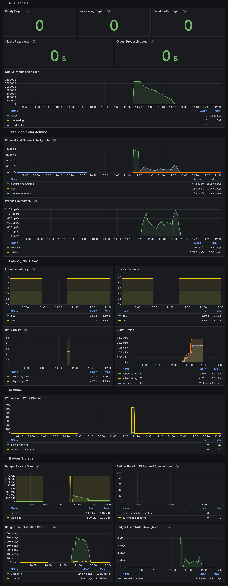

# Observability

`badgerbox` supports fully optional OpenTelemetry metrics and tracing directly in core.

- If you do not configure observability, `badgerbox` behaves exactly as before.
- Configure observability by passing an OTEL meter provider and tracer provider in `badgerbox.ObservabilityOptions`.
- `badgerbox.New(...)` is a pure constructor. It does not record a snapshot or start background polling.
- `Processor.Run(ctx)` records an initial snapshot and starts observability polling automatically before worker loops begin.
- If you are using a store without a processor, call `store.RecordObservabilitySnapshot(ctx)` once and then `store.StartObservability(ctx)` to enable queue polling metrics.
- For deterministic tests, inject a custom `badgerbox.Options.Runtime`.
- Trace context is persisted with each enqueued record, so enqueue and process spans stay linked across the durable queue boundary.
- `badgerbox` core does not bridge Badger's `expvar` metrics. If you want Badger's own storage metrics, expose `/debug/vars` from your process and, if you want Prometheus-format output, register Prometheus's expvar collector in that same process.

## What Is Instrumented

Metrics:

- Queue depths: ready, processing, dead-letter
- Queue ages: oldest ready, oldest processing
- Enqueue counts and enqueue latency
- Claim counts, claim batch sizes, schedule lag, and message age at claim time
- Processing attempt counts and processing latency
- Retry counts and retry delay
- Dead-letter counts
- Manual dead-letter requeue counts
- Expired lease requeue counts
- Conflict retry counts
- Runtime gauges for active workers and buffered work channel depth

Tracing:

- `badgerbox.enqueue`
- `badgerbox.process`

Both span types include:

- `badgerbox.namespace`
- `badgerbox.message_id`
- `badgerbox.attempt`
- `badgerbox.max_attempts`
- `badgerbox.created_at`
- `badgerbox.available_at`
- `badgerbox.outcome`

Processing spans also add events for retry scheduling, dead-lettering, and panic recovery.

## Normal Library Setup

`badgerbox` accepts an OTEL meter provider and tracer provider directly. It does not create exporters or global SDK state for you.

```go
package main

import (
	"context"
	"errors"
	"log"
	"time"

	"github.com/dgraph-io/badger/v4"
	"github.com/shawnstephens/badgerbox/pkg/badgerbox"
	"go.opentelemetry.io/otel/attribute"
	"go.opentelemetry.io/otel/exporters/otlp/otlpmetric/otlpmetrichttp"
	"go.opentelemetry.io/otel/exporters/otlp/otlptrace/otlptracehttp"
	sdkmetric "go.opentelemetry.io/otel/sdk/metric"
	"go.opentelemetry.io/otel/sdk/resource"
	sdktrace "go.opentelemetry.io/otel/sdk/trace"
)

func main() {
	ctx := context.Background()

	res, err := resource.New(ctx, resource.WithAttributes(
		attribute.String("service.name", "orders-api"),
		attribute.String("service.namespace", "example"),
	))
	if err != nil {
		log.Fatal(err)
	}

	metricExporter, err := otlpmetrichttp.New(ctx,
		otlpmetrichttp.WithEndpoint("localhost:4318"),
		otlpmetrichttp.WithInsecure(),
	)
	if err != nil {
		log.Fatal(err)
	}
	traceExporter, err := otlptracehttp.New(ctx,
		otlptracehttp.WithEndpoint("localhost:4318"),
		otlptracehttp.WithInsecure(),
	)
	if err != nil {
		log.Fatal(err)
	}

	meterProvider := sdkmetric.NewMeterProvider(
		sdkmetric.WithResource(res),
		sdkmetric.WithReader(sdkmetric.NewPeriodicReader(metricExporter)),
	)
	defer func() {
		shutdownCtx, cancel := context.WithTimeout(context.Background(), 5*time.Second)
		defer cancel()
		_ = meterProvider.Shutdown(shutdownCtx)
	}()

	traceProvider := sdktrace.NewTracerProvider(
		sdktrace.WithResource(res),
		sdktrace.WithBatcher(traceExporter),
	)
	defer func() {
		shutdownCtx, cancel := context.WithTimeout(context.Background(), 5*time.Second)
		defer cancel()
		_ = traceProvider.Shutdown(shutdownCtx)
	}()

	db, err := badger.Open(badger.DefaultOptions("./data").WithLogger(nil))
	if err != nil {
		log.Fatal(err)
	}
	defer db.Close()

	observability := badgerbox.ObservabilityOptions{
		MeterProvider:  meterProvider,
		TracerProvider: traceProvider,
	}

	store, err := badgerbox.New[string, string](
		db,
		badgerbox.Serde[string, string]{},
		badgerbox.Options{
			Namespace:     "orders",
			Observability: observability,
		},
	)
	if err != nil {
		log.Fatal(err)
	}
	defer store.Close()

	// Processor.Run handles the initial snapshot and polling startup.

	processor, err := badgerbox.NewProcessor(store, func(ctx context.Context, msg badgerbox.Message[string, string]) error {
		if msg.Payload == "fail" {
			return errors.New("retry me")
		}
		return nil
	}, badgerbox.ProcessorOptions{})
	if err != nil {
		log.Fatal(err)
	}

	if _, err := store.Enqueue(ctx, badgerbox.EnqueueRequest[string, string]{
		Payload:     "hello",
		Destination: "https://example.internal/orders",
	}); err != nil {
		log.Fatal(err)
	}

	if err := processor.Run(ctx); err != nil {
		log.Fatal(err)
	}
}
```

If you want queue-depth polling metrics without running a processor, start observability explicitly after constructing the store:

```go
if err := store.RecordObservabilitySnapshot(ctx); err != nil {
	log.Fatal(err)
}
if err := store.StartObservability(ctx); err != nil {
	log.Fatal(err)
}
```

## Enabling Only Metrics or Only Tracing

Metrics only:

```go
observability := badgerbox.ObservabilityOptions{
	MeterProvider: meterProvider,
}
```

Tracing only:

```go
observability := badgerbox.ObservabilityOptions{
	TracerProvider: traceProvider,
}
```

## Metric Catalog

Core counters:

- `badgerbox_enqueue_total`
- `badgerbox_claim_total`
- `badgerbox_process_attempt_total`
- `badgerbox_dead_letter_total`
- `badgerbox_requeue_total`
- `badgerbox_conflict_retry_total`

Core histograms:

- `badgerbox_enqueue_duration_seconds`
- `badgerbox_process_duration_seconds`
- `badgerbox_claim_batch_size`
- `badgerbox_schedule_lag_seconds`
- `badgerbox_message_age_seconds`
- `badgerbox_retry_delay_seconds`

Core gauges:

- `badgerbox_queue_ready`
- `badgerbox_queue_processing`
- `badgerbox_queue_dead_letter`
- `badgerbox_queue_oldest_ready_age_seconds`
- `badgerbox_queue_oldest_processing_age_seconds`
- `badgerbox_workers_active`
- `badgerbox_work_channel_depth`

Important attributes:

- `namespace`
- `outcome`
- `mode`
- `failure_kind`

Current meanings:

- `badgerbox_queue_ready` counts pending records in the ready index, including future scheduled retries.
- `badgerbox_queue_processing` counts valid in-flight lease records.
- `badgerbox_queue_dead_letter` counts dead-letter records.
- `badgerbox_queue_oldest_ready_age_seconds` and `badgerbox_queue_oldest_processing_age_seconds` are based on message age since enqueue, not time since scheduled availability.
- `badgerbox_schedule_lag_seconds` measures how late a claim happened relative to `AvailableAt`.
- `badgerbox_message_age_seconds` measures message age at claim time.

## Badger `expvar`

If you want Badger's own storage and engine metrics, expose `/debug/vars` from the process that owns the Badger DB and register Prometheus's expvar collector there.

For example, in an application that already owns the HTTP server:

```go
import (
	"expvar"
	"net/http"

	"github.com/prometheus/client_golang/prometheus"
	"github.com/prometheus/client_golang/prometheus/collectors"
	"github.com/prometheus/client_golang/prometheus/promhttp"
)

func main() {
	registry := prometheus.NewRegistry()
	registry.MustRegister(collectors.NewExpvarCollector(map[string]*prometheus.Desc{
		"badger_size_bytes_lsm": prometheus.NewDesc(
			"badger_size_bytes_lsm",
			"Badger LSM size in bytes exported from expvar.",
			[]string{"directory"},
			nil,
		),
		"badger_size_bytes_vlog": prometheus.NewDesc(
			"badger_size_bytes_vlog",
			"Badger value log size in bytes exported from expvar.",
			[]string{"directory"},
			nil,
		),
	}))

	mux := http.NewServeMux()
	mux.Handle("/debug/vars", expvar.Handler())
	mux.Handle("/metrics", promhttp.HandlerFor(registry, promhttp.HandlerOpts{}))

	server := &http.Server{
		Addr:    "0.0.0.0:18080",
		Handler: mux,
	}

	go server.ListenAndServe()
}
```

When you do this, open Badger with metrics enabled:

```go
db, err := badger.Open(
	badger.DefaultOptions("./data").
		WithLogger(nil).
		WithMetricsEnabled(true),
)
```

Badger caveats still apply:

- Badger metrics are registered globally in-process.
- If your process opens multiple Badger databases, some metrics are cumulative across them.
- For the cleanest results, use a dedicated Badger instance for a service or demo process.

## Local Demo Stack

The repo includes a local OTEL-to-Grafana pipeline under [demo/observability](/Users/shawn/Development/go/badgerbox/demo/observability).

It starts:

- OTEL Collector
- Prometheus
- Tempo
- Grafana
- A Prometheus scrape path to the demo producer's `/metrics`, where the producer converts selected Badger `expvar` metrics with `collectors.NewExpvarCollector`

The Collector and Tempo OTLP receivers are explicitly bound to `0.0.0.0` in this repo's config. Their default OTLP receiver binding is not suitable for this demo because traffic arrives from outside the container.

Grafana also provisions the demo metrics dashboard automatically from [demo/observability/grafana/dashboards/badgerbox-demo-observability.json](/Users/shawn/Development/go/badgerbox/demo/observability/grafana/dashboards/badgerbox-demo-observability.json).

### Start the stack

```bash
cd /Users/shawn/Development/go/badgerbox/demo/observability
docker compose up -d
```

Endpoints:

- Grafana: [http://localhost:3000](http://localhost:3000)
- Prometheus: [http://localhost:9090](http://localhost:9090)
- Tempo API: [http://localhost:3200](http://localhost:3200)
- OTLP/HTTP collector: `localhost:4318`
- OTLP/gRPC collector: `localhost:4317`

Grafana credentials:

- username: `admin`
- password: `admin`

### Dashboard import and provisioning

The local stack auto-loads the dashboard into the `Badgerbox Demo` folder in Grafana. You do not need to import it manually when you use the checked-in Docker Compose stack.

If you want to import it into another Grafana instance:

1. Open Grafana and go to `Dashboards` -> `New` -> `Import`.
2. Upload [demo/observability/grafana/dashboards/badgerbox-demo-observability.json](/Users/shawn/Development/go/badgerbox/demo/observability/grafana/dashboards/badgerbox-demo-observability.json).
3. When Grafana asks for a datasource, choose `Prometheus`.

The dashboard uses two variables:

- `namespace`, which defaults to `demo`
- `directory`, a regex for Badger expvar-derived panels that defaults to `.*`

### Run the demo

Start Kafka:

```bash
cd /Users/shawn/Development/go/badgerbox/demo
go run . kafka
```

Start the OTEL-enabled producer:

```bash
cd /Users/shawn/Development/go/badgerbox/demo
BADGERBOX_DEMO_OTEL_ENDPOINT=localhost:4318 \
BADGERBOX_DEMO_OTEL_SERVICE_NAME=badgerbox-demo-producer \
BADGERBOX_DEMO_EXPVAR_LISTEN_ADDR=0.0.0.0:18080 \
go run . producer
```

Optionally start the consumer:

```bash
cd /Users/shawn/Development/go/badgerbox/demo
go run . consumer
```

### What to look for in Grafana

On the provisioned `Badgerbox Demo Observability` dashboard with the `Prometheus` datasource:



- Queue state panels show ready, processing, and dead-letter depths plus oldest queue ages.
- Throughput panels show enqueue, claim, process, retry, dead-letter, and conflict retry rates.
- Latency panels show enqueue and process p50/p95, retry delay, schedule lag, and message age at claim time.
- Runtime panels show active workers and buffered work channel depth.
- Badger panels show storage and engine metrics from the producer's `/metrics` endpoint, where the producer republishes selected Badger `expvar` values through Prometheus's expvar collector.

In Explore with the Prometheus datasource, useful raw queries are:

- `badgerbox_queue_ready{namespace="demo"}`
- `badgerbox_queue_processing{namespace="demo"}`
- `rate(badgerbox_enqueue_total{namespace="demo"}[1m])`
- `rate(badgerbox_process_attempt_total{namespace="demo"}[1m])`
- `rate(badgerbox_dead_letter_total{namespace="demo"}[5m])`
- `histogram_quantile(0.95, sum by (le) (rate(badgerbox_process_duration_seconds_bucket{namespace="demo"}[5m])))`
- `badger_size_bytes_lsm`
- `badger_size_bytes_vlog`

In Explore with the Tempo datasource:

- use a raw TraceQL query like `{ resource.service.name = "badgerbox-demo-producer" }`
- for errors only: `{ resource.service.name = "badgerbox-demo-producer" && status = error }`
- for process spans only: `{ resource.service.name = "badgerbox-demo-producer" && name = "badgerbox.process" }`
- inspect `badgerbox.enqueue`
- inspect `badgerbox.process`
- confirm `badgerbox.process` spans have the enqueue trace as their parent chain

### Suggested verification flow

1. Start the local stack.
2. Start `badgerbox-demo kafka`.
3. Start the OTEL-enabled producer.
4. Watch `badgerbox_enqueue_total` and `badgerbox_process_attempt_total` begin increasing.
5. Stop Kafka and let the producer keep running.
6. Watch `badgerbox_queue_ready` rise and `badgerbox_retry_delay_seconds` receive samples.
7. Restart Kafka.
8. Watch the backlog drain and inspect linked enqueue and process spans in Tempo.

## Production Guidance

- Prefer metrics by default; add tracing when you need queue-path debugging or latency attribution.
- Keep attributes low-cardinality. Avoid payload-derived dimensions.
- If you scrape Badger `expvar`, treat it as process-scoped data. It is not a perfect per-store view in multi-Badger processes.
- Use short metric export intervals only for demos. For normal services, choose intervals that match your scrape and retention costs.
- Remember that `EnqueueTx` is reported as `prepared`, not `committed`, because the caller owns the surrounding transaction commit.

## Troubleshooting

No metrics:

- Verify you configured an OTEL meter provider.
- Verify your OTEL exporter reaches the collector.
- Verify the collector metrics pipeline is running.
- Verify Prometheus is scraping the collector.

No traces:

- Verify you configured an OTEL tracer provider.
- Verify the collector traces pipeline is running.
- Verify Tempo is configured and healthy.

Missing Badger metrics:

- Verify the demo producer is serving `/debug/vars` and `/metrics`.
- Verify Prometheus is scraping the producer's `/metrics` endpoint.
- Verify Badger was opened with metrics enabled. Badger defaults to enabled.
- Remember that some Badger metrics stay zero until the corresponding storage path is exercised.

Duplicate processing traces:

- Duplicate delivery is possible by design because `badgerbox` is at-least-once.
- Expired leases and retries create additional processing attempts, which correctly produce additional `badgerbox.process` spans.

Unexpected queue depth:

- `badgerbox_queue_ready` includes scheduled retry records that are pending future availability.
- Use trace and retry metrics together to understand whether backlog is active, delayed, or dead-lettered.
