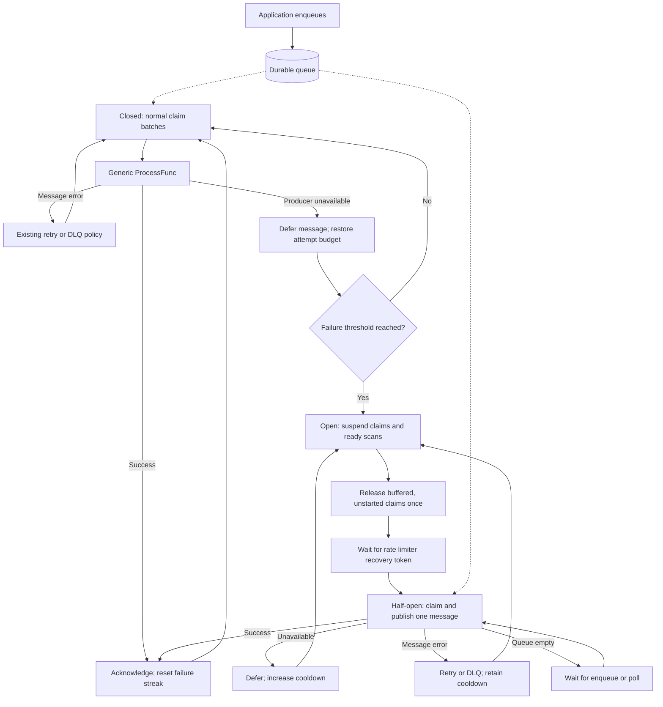

# Producer circuit breaker

Implemented on `codex/producer-circuit-breaker` against current main. The public guide is [docs/CIRCUIT_BREAKER.md](docs/CIRCUIT_BREAKER.md), linked from the README and demo documentation. The PR includes the same diagram.

The breaker uses `golang.org/x/time/rate` before durable claim admission. It is shared by single-message processors, batch processors, and runner queues. Options are copied at construction; state is private to each serialized processor run. Independent downstreams need separate queues/processors.

## API and defaults

`ProcessorOptions.CircuitBreaker *CircuitBreakerOptions` is nil by default in the library; the demo enables it. Options are `FailureThreshold` (3), `InitialCooldown` (5s), `MaxCooldown` (1m), a concurrency-safe `IsUnavailable func(error) bool`, and optional `OnStateChange func(from,to string)` notifications. Zero fields select defaults; negatives and inconsistent cooldowns are rejected. `Unavailable(error)` and `IsUnavailable(error)` preserve underlying errors. Permanent errors and producer panics retain existing handling; shutdown settlement does not update breaker state.

Closed admission is unlimited. Opening drains the initial token from a fresh burst-one limiter and reserves the next token using `ReserveN`; `DelayFrom` and cancellable `Runtime.Sleep` pace recovery. Half-open admits one message, regardless of normal batch size. A success closes the breaker; unavailable trials double cooldown to the cap; other trial failures retain cooldown. Empty claims and unstarted expired leases release trial occupancy. Generation checks reject obsolete starts and ignore late observations.

## Current-main integration

Upstream already bounds claims with worker slots and has transactional `releaseClaimed`. Extend that operation with an optional availability timestamp for outage deferral. This preserves retained-message/byte admission usage, restores scheduling indexes, refunds owned attempts, and ignores stale/quarantined records. Preserve detached settlement contexts, per-message async results, duplicate-result suppression, callback joining, and claim byte limits. During opening, release queued batches once; in-flight batches finish normally. The single dispatcher permits at most one already-admitted claim transaction to cross opening.

Kafka classification belongs in `pkg/kafka`, covering both synchronous sends and async callbacks. Known message-specific causes inside timeout error chains retain their retry/DLQ budget. The async demo also classifies terminal publish timeouts so unresolved messages defer; broker-state reload remains active. Shutdown suppresses breaker observations while preserving known outage deferrals and refunds, including marked publish deadlines; cancellation and unmarked shutdown deadlines retain normal handling. Breaker telemetry stays in `internal/instrumentation`; it does not add queue scans. The direct rate dependency resolves to v0.11.0 under upstream's existing dependency graph, without a broader upgrade.

## Validation and delivery

Test generic and batch outage recovery, no ready scans while open, exclusive trials, cancellation, stale generations, unstarted expiry, attempt refunds, retained admission, and Kafka classification. Run race tests and the repository's pinned lint in both modules (`GOWORK=off`), plus tagged Kafka tests where Docker is available. Measure a fixed simulated outage without concurrent enqueue, reaper, or GC work. Render the Mermaid diagram and verify documentation links. Commit and open a PR against main; do not merge it.

---

# Implementation and review order

The modernization is a linear stack. Each branch builds on the preceding branch; review and merge from the bottom upward. Every public library package lives under `pkg`; the executable remains a separate module under `cmd`.

| Layer | Branch | Change | Primary validation |
| --- | --- | --- | --- |
| 1 | `modernize/01-layout` | Public package layout and demo module paths | Both module builds/tests |
| 2 | `modernize/02-validation` | Dependency refresh, Justfile, lint and CI | Race tests and lint in both modules |
| 3 | `modernize/03-records` | Versioned records, opaque injected codecs, strict contexts | Binary bytes, independent defaults, incompatible-format rejection |
| 4 | `modernize/04-snapshots` | Index-derived snapshots; remove counters and repair command | Lifecycle transitions and index/row benchmark |
| 5 | `modernize/05-bounded-recovery` | Adaptive claim size and paged expired-lease recovery | Actual transaction-size limit and page boundary tests |
| 6 | `modernize/06-batch-settlement` | Per-message batch results and detached settlement | Mixed results, errors, panic, cancellation, duplicates and missing results |
| 7 | `modernize/07-worker-lifecycle` | Reserve capacity before claims; join callbacks | Single-message claims, undispatched release, message trace propagation and callback shutdown |
| 8 | `modernize/08-kafka-delivery` | Asynchronous Kafka adapter and partition control | Late callbacks, byte ownership and real-broker delivery |
| 9 | `modernize/09-audit` | Read-only index/row reconciliation | Corrupt indexes, shared key/byte budgets, incomplete reports and nonmutation |
| 10 | `modernize/10-dead-letters` | Byte-bounded pages and exact timestamp requeue | Oversized metadata pagination, bounded exact requeue and binary round trips |
| 11 | `modernize/11-admin` | Generic bounded HTTP routes | Validation, cursor isolation, timeout and admission through flush |
| 12 | `modernize/12-maintenance` | Explicit database maintenance ownership | Validation and joining an in-flight maintenance call |
| 13 | `modernize/13-telemetry` | Separate native queue/database/delivery instrumentation | Provider injection, counter resets, collector exclusivity and lifecycle |
| 14 | `modernize/14-runner` | Shared database runner with typed registration | Mixed types/codecs, duplicate names and safe shutdown timeout |
| 15 | `modernize/15-demo` | Runner-backed demo, admin and modern OTLP transports | Async scheduling, HTTP/gRPC export and graceful demo smoke test |
| 16 | `modernize/16-validation-docs` | Process recovery, executable examples and documentation | SIGTERM/SIGKILL replay, all module checks and integration suite |

The storage format intentionally rejects incompatible existing data; no automatic conversion is provided. Applications retain codec ownership and must use compatible codecs when reopening a namespace. Delivery remains at least once, including the acceptance-before-acknowledgement crash window.

Validation is scoped: local unit/race tests, real-broker integration, and local process recovery establish the tested behavior. Throughput and memory figures are benchmarks, not production capacity guarantees. The CI run associated with each PR is a separate validation result.
